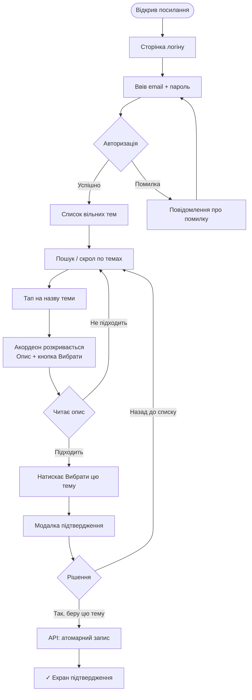
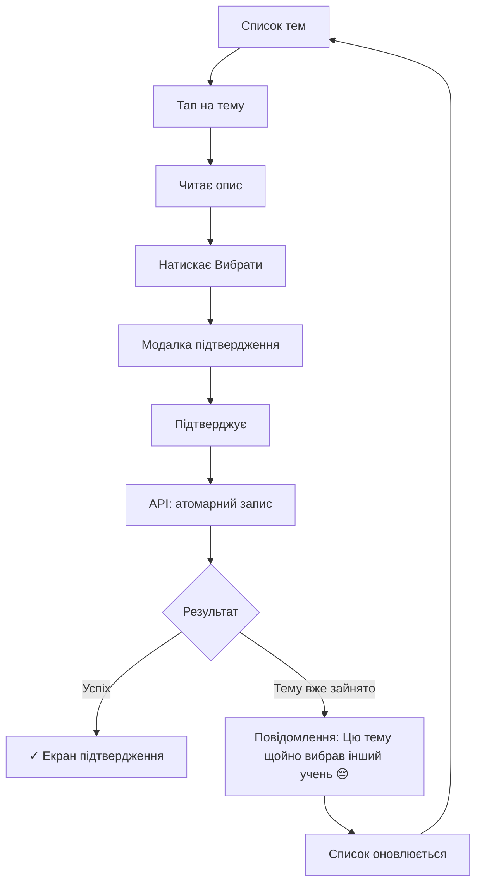
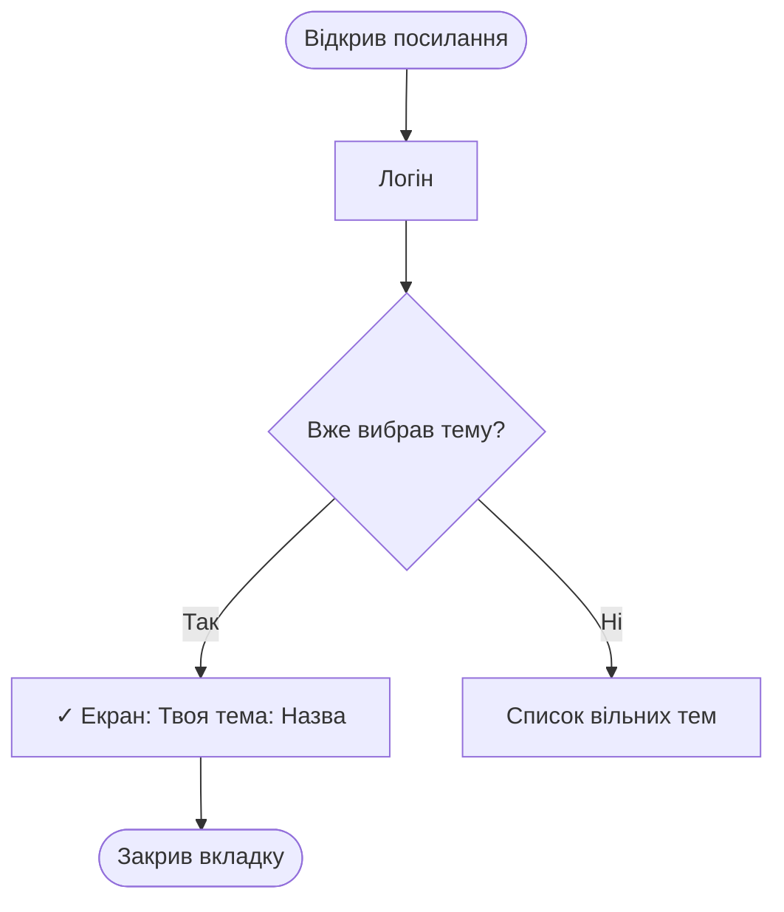
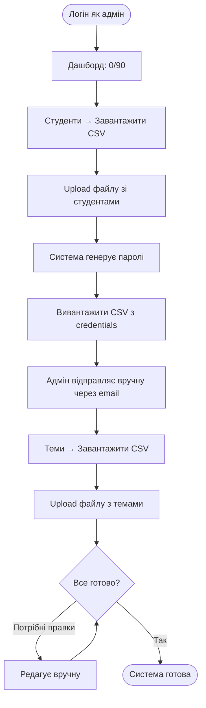
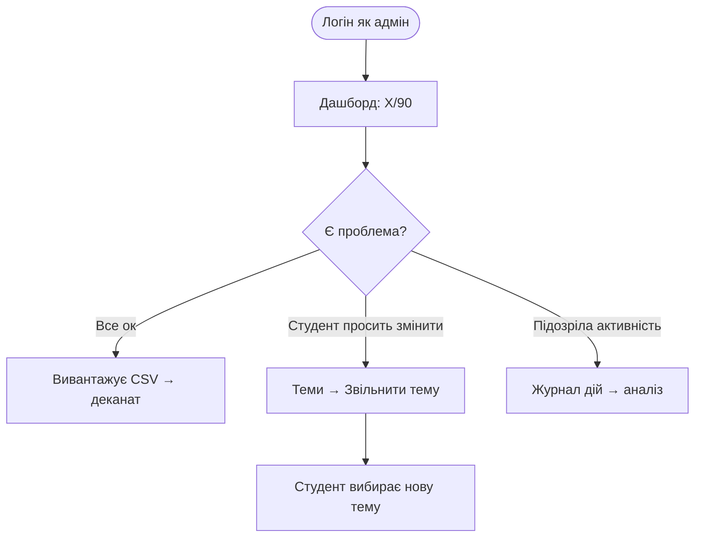

# UX Design Specification — lit

**Author:** Ss
**Date:** 2026-02-18

---

<!-- UX design content will be appended sequentially through collaborative workflow steps -->

## Executive Summary

### Project Vision

Єдиний веб-інструмент для 90 учнів 9 класу самостійно вибрати тему курсової роботи — швидко, з телефону, без участі вчителя. Вчитель керує списками один раз і отримує готовий звіт.

### Target Users

**Студент — учень 9 класу (~14-15 років)**
- Пристрій: переважно мобільний
- Технічний рівень: базовий
- Контекст: між уроками, швидка одноразова задача
- Мотивація: закрити питання з темою якомога швидше

**Адмін — вчитель**
- Технічний рівень: нетехнічний, знайомий з Excel/CSV
- Контекст: готує систему заздалегідь, потім моніторить
- Мотивація: не витрачати час на email-переписку

### Key Design Challenges

1. **Зрозуміла відмова при race condition** — людське повідомлення для учня 9 класу, не технічна помилка
2. **Необоротність вибору** — підтвердження з поясненням наслідків, без надмірних кроків
3. **Мобільна навігація по 120 темах** — пошуковий рядок + акордеон
4. **Нетехнічний адмін** — жодного IT-жаргону, чітка навігація

### Design Opportunities

1. **Мінімальний шлях для студента** — зайти → знайти → підтвердити
2. **Статус одним поглядом для адміна** — дашборд як головна сторінка
3. **Повністю українська мова** — людські тексти, не системні повідомлення

## Core User Experience

### Defining Experience

Система має одну головну взаємодію — учень вибирає тему. Все підпорядковано цій дії: жодного зайвого екрану, жодного зайвого кроку. Адмін керує даними і отримує звіт — максимально прозоро і без IT-знань.

### Platform Strategy

- Web-додаток, mobile-first
- Touch-based інтерфейс, великі tappable-зони
- Без offline-функціональності
- Без нативного додатку — браузер достатньо для одноразової дії

### Effortless Interactions

- Логін → одразу список тем (нуль проміжних екранів)
- Пошук рядком зверху — без фільтрів, без категорій
- Акордеон: натиснув назву → розкрився опис → кнопка вибору
- Адмін логін → одразу дашборд зі статусом

### Critical Success Moments

1. **Студент бачить підтвердження** — "Твоя тема: [назва]" після вибору. Це момент завершення задачі.
2. **Race condition відмова** — людське повідомлення замість технічної помилки. Учень одразу розуміє що робити далі.
3. **Адмін бачить прогрес** — `47 / 90` з першого погляду. Одна цифра замінює всю email-переписку.

### Experience Principles

1. **Нуль зайвих кроків** — кожен екран має одну мету
2. **Ясність стану** — користувач завжди знає де він і що далі
3. **Людська мова** — жодного системного жаргону в UI
4. **Необоротність як захист** — підтвердження пояснює наслідки, не лякає

## Desired Emotional Response

### Primary Emotional Goals

**Студент:** Спокійна впевненість — "я зробив що треба, все зрозуміло."
**Адмін:** Відчуття контролю — "я бачу стан, можу діяти."

### Emotional Journey Mapping

| Момент | Студент | Адмін |
|---|---|---|
| Логін | Нейтральний → одразу до справи | Нейтральний → одразу статус |
| Основна дія | Зосередженість → рішення | Впевненість → знайома дія (CSV) |
| Успіх | Полегшення + завершеність | Контроль + ефективність |
| Помилка | Зрозуміло що сталось → дія | Чітке повідомлення → виправлення |

### Design Implications

- **Полегшення після вибору** → фінальний екран чистий, без зайвих кнопок
- **Контроль для адміна** → число `47/90` на першому екрані
- **Зрозумілість при помилці** → людський текст, конкретна наступна дія
- **Нейтральний старт** → жодних welcome-екранів, одразу суть

## UX Pattern Analysis & Inspiration

### Inspiring Products Analysis

**Дія (Diia)** — державний мобільний застосунок України
- Проста навігація для нетехнічних користувачів
- Чіткі стани: "документ активний / не активний"
- Людська мова в UI без бюрократичного жаргону

**Calendly** — система вибору одного слоту зі списку
- Один вибір → підтвердження → фінальний екран
- Необоротність пояснена до дії, не після
- Мінімум кроків від входу до результату

**Google Forms** — проста форма з одним вибором
- Вертикальний список варіантів, touch-friendly
- Зрозумілий прогрес і фінальний стан "відповідь збережено"

### Transferable UX Patterns

**Навігація:**
- Акордеон для списку з описами — розкривається in-place, без переходу на нову сторінку
- Пошуковий рядок як перший елемент списку

**Взаємодія:**
- "Вибрати один з N" — великий tappable рядок, не чекбокс
- Модалка підтвердження з назвою вибраного елемента в тексті
- Фінальний екран без кнопок "назад" або "змінити"

**Адмін:**
- Прогрес-індикатор `X / Y` як головний елемент дашборду
- CSV import/export як основний спосіб масових операцій (знайома модель для Excel-користувачів)

### Anti-Patterns to Avoid

- **Пагінація на мобільному** — для 120 тем краще єдиний скролл + пошук
- **Wizard з кількома кроками** для простої дії вибору
- **"Ви впевнені?"** без контексту — модалка має містити назву теми і пояснення наслідків
- **Технічні повідомлення про помилки** — "Error 409 Conflict" замість "Цю тему щойно вибрав інший учень"
- **Іконки без підписів** в адмін-навігації

### Design Inspiration Strategy

**Взяти:**
- Акордеон Дії: простий, touch-friendly, без зайвих переходів
- Модель підтвердження Calendly: назва + наслідки до дії
- CSV-модель Google Sheets: знайома адміну без навчання

**Адаптувати:**
- Прогрес Calendly → `47 / 90` для адмін-дашборду
- Фінальний екран Google Forms → підтвердження вибору теми

**Уникати:**
- Будь-якої складності понад мінімально необхідне
- Англомовних елементів UI

## Design System Foundation

### Design System Choice

**shadcn/ui + Tailwind CSS**

### Rationale for Selection

- Дедлайн 7 днів — готові компоненти (Accordion, Dialog, Table) без написання з нуля
- React + Vite — нативна інтеграція, нуль конфліктів
- Компоненти в проєкті — copy-paste в `/components/ui`, повний контроль
- Radix UI — accessibility вбудована, keyboard navigation, ARIA автоматично
- Mobile-first — Tailwind utility classes оптимізовані для responsive

### Implementation Approach

- `npx shadcn@latest init` на старті проєкту
- Компоненти за потребою: `Accordion`, `Dialog`, `Button`, `Input`, `Table`, `Badge`, `Progress`
- Кольорова схема через CSS variables у `globals.css`

### Color Palette

**Студентський UI:**
- Фон сторінки: `#FAF5FF`
- Фон карток: `#EDD9FB`
- Кнопки / акцент: `#B436F0`
- Hover / заголовки: `#471260`

**Адмін-панель:**
- Sidebar: `#471260`
- Active nav item: `#B436F0`
- Контентна зона: `#F2F2F2`
- Картки / статс: `#FFFFFF`
- CTA кнопки: `#B436F0`
- Другорядний акцент: `#F24C0A`

**Загальне:**
- Основний текст: `#2b2b2b`
- Borders: `#EDD9FB` / `#e0e0e0`
- Error / відмова: `#F24C0A`

### Customization Strategy

- Всі тексти компонентів — українською
- Touch-targets: мін. 44px висота для мобільних елементів списку
- Корпоративна палітра dnlit.dp.ua — фіолетовий `#B436F0` як primary

## Defining Core Experience

### 2.1 Defining Experience

Визначальна взаємодія: **учень знаходить тему і забирає її собі одним підтвердженням.**

Якщо це зроблено ідеально — все інше слідує автоматично. Студент описуватиме це як: "зайшов, вибрав, все."

### 2.2 User Mental Model

Поточна модель: "треба написати вчителю email → чекати відповідь → може вже зайнята → писати ще раз."

Нова модель: "бачу список → читаю опис → натискаю → моє."

Перехід природний — акордеон + кнопка вибору відповідають інтуїції "вибрати з переліку."

### 2.3 Success Criteria

- Студент завершує вибір за ≤3 хвилини від першого входу
- Жодного питання "а що тепер робити?" на будь-якому кроці
- Підтвердження однозначне — немає сумнівів чи тема вибрана
- При відмові (race condition) — наступна дія очевидна

### 2.4 Novel vs. Established Patterns

**Виключно встановлені патерни** — жодної новизни не потрібно:
- Accordion list — знайомий з FAQ, месенджерів
- Confirmation modal — знайомий з будь-якого checkout
- Final state screen — знайомий з Google Forms

Новизна не потрібна. Простота і є UX.

### 2.5 Experience Mechanics

**1. Ініціація:** Логін → список тем одразу (нуль проміжних екранів). Пошуковий рядок зверху.

**2. Взаємодія:** Скрол / пошук → тап на назву теми → акордеон розкривається → опис + науковий керівник + кафедра + кнопка "Вибрати цю тему"

**3. Feedback:** Модалка:
*"Ти вибираєш: [Назва теми]. Змінити самостійно не можна — тільки через вчителя. Впевнений(а)?"*
→ [Так, беру цю тему] / [Назад до списку]

**4. Завершення:** Екран:
*"✓ Твоя тема: [Назва]. Якщо потрібна зміна — звернись до вчителя."*
Жодних інших кнопок. Задача виконана.

## Visual Design Foundation

### Color System

Базується на корпоративній палітрі dnlit.dp.ua:

| Роль | Hex | Використання |
|---|---|---|
| Primary | `#B436F0` | Кнопки, акценти, посилання |
| Primary Dark | `#471260` | Sidebar, заголовки, hover |
| Primary Mid | `#442e66` | Навігація адмін |
| Surface | `#FAF5FF` | Фон сторінки (студент) |
| Surface Alt | `#EDD9FB` | Фон карток, accordion |
| Admin BG | `#F2F2F2` | Контентна зона адмін |
| CTA Alt | `#F24C0A` | Другорядні CTA, помилки |
| Text | `#2b2b2b` | Основний текст |
| Border | `#e0e0e0` | Розділювачі |

Contrast ratios: `#B436F0` на `#FAF5FF` ≥ 4.5:1 ✓

### Typography System

**Шрифт:** Inter (Google Fonts, безкоштовний)

| Рівень | Розмір | Вага | Використання |
|---|---|---|---|
| H1 | 24px | 700 | Заголовок сторінки |
| H2 | 18px | 600 | Секції |
| Body | 16px | 400 | Основний текст, описи тем |
| Small | 14px | 400 | Метадані, підказки |
| Button | 14px | 600 | Кнопки |

Line-height: 1.5 для body, 1.2 для заголовків.

### Spacing & Layout Foundation

**Base unit:** 4px (Tailwind default)
**Основні значення:** 4 · 8 · 12 · 16 · 24 · 32 · 48px

**Мобільний layout (студент):**
- Padding сторінки: 16px горизонтально
- Touch target: мін. 44px висота для кожного рядка списку
- Accordion item padding: 16px вертикально
- Gap між елементами списку: 2px

**Десктоп layout (адмін):**
- Sidebar width: 200px fixed
- Content padding: 24px
- Card padding: 20px
- Grid gap: 16px

### Accessibility Considerations

- Мінімальний розмір шрифту: 14px
- Contrast ratio Primary на фоні: ≥ 4.5:1
- Touch targets: ≥ 44×44px (WCAG 2.5.5)
- Focus states: shadcn/ui + Radix забезпечують автоматично
- Повідомлення про помилки: текст + колір (не тільки колір)

## Design Direction Decision

### Design Directions Explored

6 варіантів для студентського UI: Clean Cards, Borderless Minimal, Bold Purple ✓, Compact Dense, Success State, Race Condition State.

### Chosen Direction

**Варіант 3 — Bold Purple**

- Градієнтний hero-header: `linear-gradient(135deg, #471260 → #B436F0)`
- Пошук floating нижче header з тінню
- Акордеон: left-border `3px solid #B436F0` при розкритті
- Badge "вільна" у кожному рядку (`#EDD9FB` bg, `#B436F0` text)
- Кнопка "Вибрати цю тему" всередині розкритого елемента

Адмін-панель: темний sidebar `#471260` + контентна зона `#F2F2F2`

### Design Rationale

- Градієнт передає корпоративний стиль dnlit.dp.ua
- Left-border акцент чіткіше позначає активну тему
- Badge "вільна" дає моментальний статус без кліку
- Floating search з тінню — сучасний mobile pattern 2026

### Implementation Approach

- shadcn/ui `Accordion` як база з Tailwind-перевизначенням
- `Dialog` для модалки підтвердження
- CSS gradient: `bg-gradient-to-br from-[#471260] to-[#B436F0]`
- Left-border: `border-l-4 border-[#B436F0]` на active item

## User Journey Flows

### Journey 1: Студент — успішний вибір теми

### Journey 2: Студент — race condition

### Journey 3: Студент — повторний вхід

### Journey 4: Адмін — підготовка системи

### Journey 5: Адмін — моніторинг та коригування

### Journey Patterns

**Навігація:** Єдина точка входу — логін. Після успіху — фінальний екран без зворотного шляху.

**Рішення:** Модалка підтвердження тільки для незворотних дій. Помилки не блокують — одразу показують наступну дію.

**Feedback:** Успіх — екран підтвердження з назвою теми. Відмова — повідомлення + оновлений список.

### Flow Optimization Principles

1. **Zero dead ends** — кожен стан помилки веде до наступної дії
2. **Мінімум кроків** — логін → список → вибір → підтвердження (4 кроки)
3. **Атомарність** — API або повертає успіх, або явну відмову
4. **Стан завжди видимий** — студент знає чи вибрав тему з першого погляду

## Component Strategy

### Design System Components (shadcn/ui — as-is)

| Компонент | Використання |
|---|---|
| `Accordion` | Список тем зі розкриттям опису |
| `Dialog` | Модалка підтвердження вибору |
| `Button` | Всі кнопки дій |
| `Input` | Пошуковий рядок |
| `Table` | Адмін таблиці студентів і тем |
| `Badge` | Статус "вільна" / "зайнята" |
| `Progress` | Прогрес-бар X/90 на дашборді |
| `Alert` | Race condition повідомлення |

### Custom Components

#### `TopicAccordionItem`
**Призначення:** Рядок теми з left-border акцентом при розкритті
**Стани:** default | open (border-l-4 #B436F0) | hover
**Анатомія:** назва теми · badge "вільна" · chevron · [опис · науковий керівник · кафедра · кнопка при open]
**ARIA:** `role="button"`, `aria-expanded`, `aria-controls`

#### `TopicConfirmDialog`
**Призначення:** Модалка підтвердження з назвою теми і поясненням наслідків
**Контент:** *"Ти вибираєш: [Назва]. Змінити самостійно не можна — тільки через вчителя."*
**Кнопки:** [Так, беру цю тему] / [Назад до списку]

#### `TopicConfirmedScreen`
**Призначення:** Фінальний екран після успішного вибору — жодних кнопок дії
**Анатомія:** checkmark (#B436F0) · "Тему вибрано!" · назва теми · науковий керівник · кафедра · підказка про зміну

#### `RaceConditionAlert`
**Призначення:** Повідомлення коли тему щойно забрав інший учень
**Контент:** *"Цю тему щойно вибрав інший учень 😔 Список оновлено — оберіть іншу."*

#### `AdminStatCard`
**Призначення:** Картка з числовою статистикою на дашборді
**Варіанти:** primary (border #B436F0) · warning (border #F24C0A)

#### `AdminSidebar`
**Призначення:** Навігаційна панель адміна
**Nav items:** Статус · Студенти · Теми · Журнал дій

### Component Implementation Strategy

- Custom компоненти будуються поверх shadcn/ui primitives
- Кольори через Tailwind arbitrary values: `border-[#B436F0]`
- Тексти українською hardcode в компоненті (одна мова, без i18n)
- Кожен компонент має `data-testid` для E2E тестів

### Implementation Roadmap

**Phase 1 — Критичний студентський флоу:**
`TopicAccordionItem` → `TopicConfirmDialog` → `TopicConfirmedScreen`

**Phase 2 — Edge cases:**
`RaceConditionAlert`

**Phase 3 — Адмін-панель:**
`AdminSidebar` → `AdminStatCard`

## UX Consistency Patterns

### Button Hierarchy

| Рівень | Вигляд | Використання |
|---|---|---|
| Primary | `bg-[#B436F0] text-white` | "Вибрати цю тему", "Так, беру" |
| Secondary | `border-[#B436F0] text-[#B436F0]` | "Назад до списку" |
| Destructive | `bg-[#F24C0A] text-white` | "Звільнити тему" |
| Ghost | `text-[#B436F0]` без рамки | Посилання-дії в таблиці |

Мінімальна висота кнопки: **44px** (mobile touch target).

### Feedback Patterns

- **Успіх:** Повноекранний `TopicConfirmedScreen` — не toast. Дія незворотня, потребує явного фінального стану.
- **Race condition:** `RaceConditionAlert` з emoji 😔 inline у верхній частині списку. Автодисмісс через 8с.
- **Помилка авторизації:** Inline під формою — *"Невірний email або пароль."*
- **Помилка CSV:** `Alert` зі списком рядків з помилками.
- **Завантаження:** Spinner на кнопці + `disabled` під час API-запиту.

### Form Patterns

- Label зверху поля, placeholder тільки для формату
- Помилка після blur або submit, не під час введення
- Пошук: debounce 300ms, хрестик для очищення
- CSV Upload: drag & drop + preview перших 3 рядків

### Navigation Patterns

- **Студент:** без навігації — єдиний маршрут
- **Адмін:** sidebar, active `bg-[#B436F0]`, поточна сторінка не клікабельна

### Modal Patterns

Тільки `TopicConfirmDialog`. Не закривається кліком на overlay. Фокус при відкритті — на кнопці "Назад" (безпечніша дія).

### Empty States

- Всі теми вибрані: *"Всі теми вже вибрані. Зверніться до вчителя."*
- Студентів немає: *"Студентів ще немає. Завантажте CSV щоб додати."*
- Пошук без результатів: *"Нічого не знайдено за запитом «[query]»"*

### Loading States

- Список тем: skeleton-рядки (3-5 штук)
- Кнопка підтвердження: spinner + disabled
- CSV upload: прогрес-бар
- Початкове завантаження: skeleton, не spinner

## Responsive Design & Accessibility

### Responsive Strategy

**Студентський UI — mobile-first:** основний досвід для 375px. Десктоп: той самий layout з більшими відступами і `max-width: 480px` centered.

**Адмін-панель — desktop-first:** Sidebar + content. На < 768px sidebar collapse у верхні tabs.

### Breakpoint Strategy

Tailwind defaults (mobile-first):

| Breakpoint | Розмір | Використання |
|---|---|---|
| default | 0px+ | Студентський мобільний layout |
| `sm` | 640px+ | Збільшені відступи |
| `md` | 768px+ | Адмін sidebar з'являється |
| `lg` | 1024px+ | Адмін повний desktop layout |

### Accessibility Strategy

**Цільовий рівень: WCAG 2.1 AA**

- Contrast ratio ≥ 4.5:1 (`#B436F0` на `#FAF5FF` ✓)
- Touch targets ≥ 44×44px
- Focus indicators: Radix UI автоматично
- Keyboard: Tab / Enter / Escape для модалки
- Screen reader: semantic HTML + ARIA через shadcn/ui

### Testing Strategy

- Chrome DevTools: 375px / 390px / 768px
- Safari на iOS (webkit специфіка)
- `axe DevTools` для автоматичних a11y перевірок
- Keyboard-only navigation тест перед релізом

### Implementation Guidelines

- Mobile-first Tailwind: `px-4 md:px-6`, `max-w-[480px] mx-auto md:max-w-none`
- Semantic HTML: `<main>`, `<nav>`, `<button>` (не `
`)
- Forms: `<label htmlFor>` прив'язаний до `<input id>`
- Модалка: `aria-modal="true"`, focus trap (Radix Dialog)
- Accordion: `aria-expanded`, `aria-controls` (Radix Accordion)
